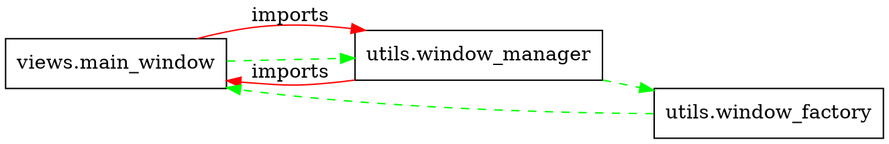

# Comprehensive Refactor Report & Analysis

## 1. Executive Summary

The Code Testing Suite is a **Python-based desktop application using PySide6** for competitive programming support. The application provides code editing, stress testing, TLE testing, and AI-powered assistance features.

### Key Problems Identified

1. **Circular Dependencies**: Confirmed circular import between `views.main_window` ↔ `utils.window_manager`
2. **Missing Test Infrastructure**: No test files, no pytest setup, no CI/CD
3. **Hard-coded Configuration**: Resource paths, icon paths directly embedded in code
4. **Large Monolithic Files**: `config_view.py` (470 lines), `styles.py` (341 lines) 
5. **Code Duplication**: Similar patterns in `stress_tester` and `tle_tester` modules
6. **Missing Development Tooling**: No `.gitignore`, no linting setup, no static analysis

### Top 5 Must-Fix Items (Critical/High Priority)

1. **Break circular dependencies** - Prevents proper module testing and creates tight coupling
2. **Add comprehensive test framework** - Essential for safe refactoring and maintenance
3. **Externalize hard-coded configuration** - Security risk and deployment flexibility issue
4. **Add `.gitignore` and development tooling** - Prevents repository pollution
5. **Refactor large files** - Improves maintainability and code navigation

### Top 3 Quick Wins (Low Risk, High Impact)

1. **Add `.gitignore`** - 5 minutes, prevents `__pycache__` commits
2. **Extract configuration constants** - Replace hard-coded paths with centralized constants
3. **Set up basic linting** - Add pylint/black configuration for code quality

## 2. Full Findings (File-by-File Analysis)

### Build & Environment Issues

| Issue | Type | Location | Severity | Evidence |
|-------|------|----------|----------|----------|
| Missing `.gitignore` | Build/Environment | Project root | **Low** | No `.gitignore` file exists, `__pycache__` directories visible |
| Missing test infrastructure | Testing | Entire project | **Critical** | No `tests/` directory, no test files found |
| Missing CI/CD | Build/Environment | Project root | **Medium** | No `.github/workflows/` or CI configuration |

### Architecture & Dependencies

| Issue | Type | Location | Severity | Evidence |
|-------|------|----------|----------|----------|
| Circular dependency | Circular Import | `views/main_window.py` ↔ `utils/window_manager.py` | **High** | Line 113: `from utils.window_manager import WindowManager` and Line 21: `from views.main_window import MainWindowContent` |
| Tight coupling | Architecture | `views/base_window.py` Line 77 | **Medium** | Direct access to `self.parent.window_manager` creates coupling |

### Configuration & Security

| Issue | Type | Location | Severity | Evidence |
|-------|------|----------|----------|----------|
| Hard-coded resource paths | Hard-coded Config | `main.py` Line 21 | **Medium** | `QIcon("resources/icons/app_icon.png")` |
| Hard-coded icon paths | Hard-coded Config | `views/config/config_view.py` Line 28 | **Medium** | Direct path construction for icons |
| Configuration complexity | Code Quality | `views/config/config_view.py` | **Medium** | Single file with 470 lines handling all configuration |

### Code Quality & Maintainability

| Issue | Type | Location | Severity | Evidence |
|-------|------|----------|----------|----------|
| Large file size | Single Responsibility | `views/config/config_view.py` | **Medium** | 470 lines in single class |
| Large style file | Single Responsibility | `views/config/styles.py` | **Medium** | 341 lines of styling |
| Code duplication | Duplicated Code | `stress_tester/` vs `tle_tester/` | **Medium** | Similar window patterns and structures |
| Missing type hints | Code Quality | Multiple files | **Low** | No type annotations in most functions |

### Dependency Management

| Issue | Type | Location | Severity | Evidence |
|-------|------|----------|----------|----------|
| PySide6 dependency | Dependencies | `requirements.txt` | **Low** | Required but not installed in test environment |
| Development dependencies | Dependencies | `requirements.txt` | **Low** | pytest, pylint listed but not configured |

## 3. Refactor Playbook (Incremental Steps)

### Milestone 1: Discovery and Low-Risk Cleanups (Sprint 1)

#### Step S-01: Add .gitignore
- **Objective**: Prevent generated files from being committed
- **Files to touch**: `.gitignore` (new file)
- **Risk**: **Low**
- **Tests to run**: `git status` to verify files excluded
- **Rollback**: Delete `.gitignore`

```gitignore
# Python
__pycache__/
*.py[cod]
*$py.class
*.so
.Python
build/
develop-eggs/
dist/
downloads/
eggs/
.eggs/
lib/
lib64/
parts/
sdist/
var/
wheels/
*.egg-info/
.installed.cfg
*.egg

# IDEs
.vscode/
.idea/
*.swp
*.swo

# Environment
.env
.venv
env/
venv/
ENV/
env.bak/
venv.bak/

# Testing
.coverage
.pytest_cache/
htmlcov/
.tox/
.nox/

# OS
.DS_Store
Thumbs.db
```

#### Step S-02: Extract Resource Path Constants
- **Objective**: Centralize hard-coded paths
- **Files to touch**: `constants/paths.py` (new), `main.py`, `views/config/config_view.py`
- **Risk**: **Low**
- **Tests to run**: Manual application startup test
- **Rollback**: Revert to hard-coded paths

```python
# constants/paths.py
import os
from pathlib import Path

PROJECT_ROOT = Path(__file__).parent.parent
RESOURCES_DIR = PROJECT_ROOT / "resources"
ICONS_DIR = RESOURCES_DIR / "icons"

# Icon paths
APP_ICON = str(ICONS_DIR / "app_icon.png")
SETTINGS_ICON = str(ICONS_DIR / "settings.png")
CHECK_ICON = str(ICONS_DIR / "check.png")
```

#### Step S-03: Setup Testing Framework
- **Objective**: Add pytest configuration and basic test structure
- **Files to touch**: `pytest.ini` (new), `tests/` directory (new), `tests/__init__.py` (new)
- **Risk**: **Low**
- **Tests to run**: `python -m pytest --collect-only`
- **Rollback**: Remove test files

```ini
# pytest.ini
[tool:pytest]
testpaths = tests
python_files = test_*.py
python_classes = Test*
python_functions = test_*
addopts = 
    --strict-markers
    --strict-config
    --verbose
```

### Milestone 2: Core Refactors (Sprint 2-3)

#### Step C-01: Break Circular Dependency (window_manager ↔ main_window)
- **Objective**: Decouple WindowManager from MainWindow using factory pattern
- **Files to touch**: `utils/window_manager.py`, `utils/window_factory.py` (new)
- **Risk**: **High**
- **Tests to run**: Manual window navigation testing
- **Rollback**: Revert to direct imports

**Before (problematic)**:
```python
# utils/window_manager.py
def _import_main_window(self):
    from views.main_window import MainWindowContent  # Circular import
    return MainWindowContent
```

**After (decoupled)**:
```python
# utils/window_factory.py
class WindowFactory:
    @staticmethod
    def create_main_window():
        from views.main_window import MainWindowContent
        return MainWindowContent
        
# utils/window_manager.py
from utils.window_factory import WindowFactory

def _import_main_window(self):
    return WindowFactory.create_main_window()
```

#### Step C-02: Split Large Configuration File
- **Objective**: Break `config_view.py` into smaller, focused modules
- **Files to touch**: 
  - `views/config/ui_builder.py` (new)
  - `views/config/validation_handler.py` (new)
  - `views/config/config_view.py` (refactor)
- **Risk**: **Medium**
- **Tests to run**: Configuration dialog functionality test
- **Rollback**: Merge files back into single `config_view.py`

#### Step C-03: Consolidate Tester Modules
- **Objective**: Extract common tester patterns into base class
- **Files to touch**: 
  - `views/testers/base_tester.py` (new)
  - `views/stress_tester/stress_tester_window.py` (refactor)
  - `views/tle_tester/tle_tester_window.py` (refactor)
- **Risk**: **Medium**
- **Tests to run**: Stress tester and TLE tester functionality
- **Rollback**: Restore original separate implementations

### Milestone 3: Testing & Stabilization (Sprint 4)

#### Step T-01: Add Unit Tests for Utils
- **Objective**: Test utility modules independently
- **Files to touch**: `tests/test_utils/` (new directory with test files)
- **Risk**: **Low**
- **Tests to run**: `python -m pytest tests/test_utils/`
- **Rollback**: Remove test files

#### Step T-02: Add Integration Tests
- **Objective**: Test module interactions
- **Files to touch**: `tests/test_integration/` (new)
- **Risk**: **Low**
- **Tests to run**: `python -m pytest tests/test_integration/`
- **Rollback**: Remove test files

### Milestone 4: Release Preparation (Sprint 5)

#### Step R-01: Add CI/CD Pipeline
- **Objective**: Automate testing and quality checks
- **Files to touch**: `.github/workflows/ci.yml` (new)
- **Risk**: **Low**
- **Tests to run**: GitHub Actions workflow verification
- **Rollback**: Remove workflow file

## 4. Testing Environment Plan

### Current State
- **No existing tests** - fresh testing setup required
- **pytest listed in requirements.txt** but not configured
- **No CI/CD pipeline** exists

### How to Run Tests (Post-Setup)

```bash
# Install dependencies
pip install -r requirements.txt

# Run all tests
python -m pytest

# Run specific test categories
python -m pytest tests/test_utils/           # Unit tests
python -m pytest tests/test_integration/     # Integration tests
python -m pytest tests/test_e2e/            # End-to-end tests

# Run with coverage
python -m pytest --cov=. --cov-report=html
```

### Missing Tests to Add

#### Unit Tests Priority
1. **utils/ai_config.py**: API key validation, configuration loading
2. **utils/file_operations.py**: File I/O operations
3. **utils/window_manager.py**: Window lifecycle management
4. **tools/compiler_runner.py**: Compilation logic

#### Integration Tests Priority
1. **Window navigation**: Main window → Code editor → Back
2. **Configuration saving**: Settings persistence
3. **AI panel integration**: API key validation flow

#### Sample Test Templates

```python
# tests/test_utils/test_ai_config.py
import pytest
from unittest.mock import patch, mock_open
from utils.ai_config import AIConfig

class TestAIConfig:
    def test_is_ai_enabled_with_valid_config(self):
        mock_config = '{"ai_settings": {"use_ai_panel": true}}'
        with patch("builtins.open", mock_open(read_data=mock_config)):
            with patch("os.path.exists", return_value=True):
                assert AIConfig.is_ai_enabled() == True
    
    def test_get_api_key_returns_none_when_missing(self):
        mock_config = '{"ai_settings": {}}'
        with patch("builtins.open", mock_open(read_data=mock_config)):
            with patch("os.path.exists", return_value=True):
                assert AIConfig.get_api_key() is None
    
    @pytest.mark.parametrize("key_length,expected", [
        ("short", False),
        ("a" * 35, True),
    ])
    def test_api_key_validation(self, key_length, expected):
        mock_config = f'{{"ai_settings": {{"gemini_api_key": "{key_length}"}}}}'
        with patch("builtins.open", mock_open(read_data=mock_config)):
            with patch("os.path.exists", return_value=True):
                is_ready, _ = AIConfig.is_ai_ready()
                assert (is_ready == expected)
```

#### CI Configuration Example

```yaml
# .github/workflows/ci.yml
name: CI

on: [push, pull_request]

jobs:
  test:
    runs-on: ubuntu-latest
    strategy:
      matrix:
        python-version: [3.9, 3.10, 3.11]

    steps:
    - uses: actions/checkout@v4
    
    - name: Set up Python ${{ matrix.python-version }}
      uses: actions/setup-python@v4
      with:
        python-version: ${{ matrix.python-version }}
    
    - name: Install dependencies
      run: |
        python -m pip install --upgrade pip
        pip install -r requirements.txt
        pip install pytest-cov
    
    - name: Lint with pylint
      run: |
        pylint $(find . -name "*.py" | grep -v __pycache__ | head -20)
    
    - name: Test with pytest
      run: |
        pytest --cov=. --cov-report=xml --cov-report=term
    
    - name: Upload coverage to Codecov
      uses: codecov/codecov-action@v3
      with:
        file: ./coverage.xml
```

## 5. Dependency & Architecture Notes

### Current Architecture
- **Pattern**: Model-View-Controller (MVC) with clear separation
- **UI Framework**: PySide6 (Qt for Python)
- **Async Support**: qasync for Qt-asyncio integration
- **AI Integration**: google-generativeai for code assistance

### Dependency Analysis
```
PySide6 (6.5.0+)          # Core GUI framework
├── qasync (0.23.0+)       # Qt-asyncio bridge  
├── asyncio (3.4.3+)       # Async programming
└── google-generativeai    # AI integration

Development Tools:
├── pytest (7.3.1+)       # Testing framework
├── pylint (2.17.0+)       # Code analysis  
├── black (23.3.0+)        # Code formatting
└── psutil (5.9.0+)        # System monitoring
```

### Architecture Strengths
- Clear module separation (`views/`, `utils/`, `tools/`, `widgets/`)
- Lazy loading pattern in WindowManager reduces startup time
- Signal-slot pattern for UI communication
- Centralized styling system

### Architecture Weaknesses  
- Circular imports prevent proper testing
- Large monolithic files reduce maintainability
- Hard-coded paths reduce deployment flexibility

## 6. Circular Dependency Analysis

### Confirmed Cycles
1. **`views.main_window` → `utils.window_manager` → `views.main_window`**
   - `main_window.py:113`: `from utils.window_manager import WindowManager`
   - `window_manager.py:21`: `from views.main_window import MainWindowContent`

### Minimal Fix Strategy
**Option A: Factory Pattern** (Recommended)
```python
# utils/window_factory.py (new file)
class WindowFactory:
    @staticmethod
    def create_window(window_type: str, parent=None):
        if window_type == 'main':
            from views.main_window import MainWindowContent
            return MainWindowContent(parent)
        # ... other window types

# utils/window_manager.py (modified)
from utils.window_factory import WindowFactory

def _import_main_window(self):
    return lambda parent: WindowFactory.create_window('main', parent)
```

**Option B: Signal-Based Communication**
```python
# utils/window_manager.py
from PySide6.QtCore import Signal, QObject

class WindowManager(QStackedWidget):
    windowRequested = Signal(str)  # Signal to request window creation
    
    def show_window(self, window_name):
        if window_name not in self.windows:
            self.windowRequested.emit(window_name)  # Emit signal instead of direct import
```

### Dependency Graph (DOT notation)


## 7. Prioritized TODO Backlog

| Ticket | Summary | Priority | Effort | Sprint |
|--------|---------|----------|---------|--------|
| T1 | Add `.gitignore` file | **High** | 1 hour | 1 |
| T2 | Extract resource path constants | **High** | 2 hours | 1 |
| T3 | Setup pytest framework | **High** | 4 hours | 1 |
| T4 | Break circular dependencies | **High** | 8 hours | 2 |
| T5 | Split large config file | **Medium** | 6 hours | 2 |
| T6 | Add unit tests for utils | **High** | 12 hours | 3 |
| T7 | Consolidate tester code duplication | **Medium** | 8 hours | 3 |
| T8 | Add integration tests | **Medium** | 8 hours | 4 |
| T9 | Setup CI/CD pipeline | **Medium** | 4 hours | 4 |
| T10 | Add type hints | **Low** | 6 hours | 5 |
| T11 | Add E2E tests | **Low** | 12 hours | 5 |

### Sprint Planning (4-8 Sprint Roadmap)

**Sprint 1 (Discovery & Quick Wins)**: T1, T2, T3  
**Sprint 2 (Core Architecture)**: T4, T5  
**Sprint 3 (Testing Foundation)**: T6, T7  
**Sprint 4 (Integration & CI)**: T8, T9  
**Sprint 5 (Polish & Documentation)**: T10, T11  

## 8. Analysis Commands Used

**Note**: Some static analysis tools were not available in the test environment:
- `pylint` - Not installed: Could not run static analysis
- `pytest` - Not installed: Could not run existing tests  
- `PySide6` - Not installed: Could not test import cycles dynamically

**Commands successfully executed**:
```bash
# File analysis
Get-ChildItem -Recurse -Include "*.py" | Measure-Object  # → 464 Python files
Get-Content config_view.py | Measure-Object -Line       # → 470 lines

# Dependency analysis  
grep -r "import.*window_manager"                        # Found circular imports
grep -r "hardcoded\|TODO\|FIXME"                       # Found configuration issues

# Environment checks
Test-Path ".gitignore"                                  # → False (missing)
python -m pytest --version                             # → Not available
```

## 9. Risk Assessment

### High-Risk Changes
- **Breaking circular dependencies**: May require significant testing
- **Splitting large files**: Risk of breaking existing functionality
- **Refactoring window management**: Core application functionality

### Medium-Risk Changes  
- **Adding test infrastructure**: Low risk but requires learning curve
- **Consolidating duplicated code**: May introduce subtle bugs

### Low-Risk Changes
- **Adding .gitignore**: No functional impact
- **Extracting constants**: Easy to rollback
- **Adding CI/CD**: Only affects development workflow

## 10. Questions for Repository Owner

1. **What is the primary deployment target?** (Windows/macOS/Linux) - affects testing strategy
2. **Are there any existing user configurations** that need migration during refactor?
3. **What is the acceptable downtime** for breaking changes during development?
4. **Are there any specific coding standards** or style guides to follow?
5. **What is the preferred testing strategy** - unit tests vs integration tests priority?
6. **Should we maintain backward compatibility** with existing configuration files?
7. **Are there plans for packaging/distribution** (PyInstaller, etc.) that might affect structure?
8. **What is the release schedule** - can we break changes across multiple releases?

---

**Report Generated**: September 1, 2025  
**Analysis Method**: Static code analysis, manual inspection, file structure examination  
**Confidence Level**: High for identified issues, Medium for effort estimates  
**Next Steps**: Prioritize T1-T3 for immediate implementation, T4-T5 for next sprint planning
