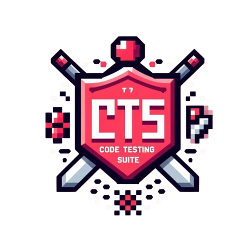
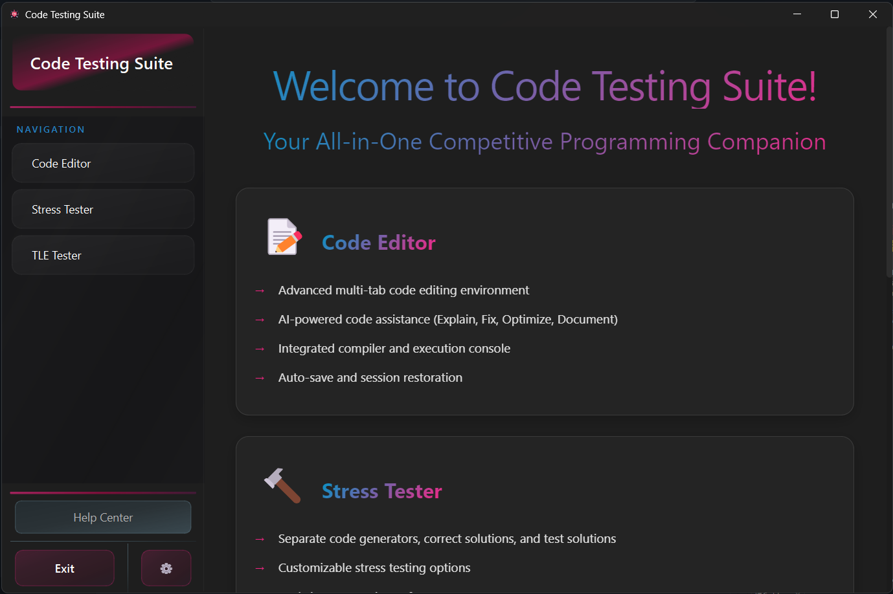
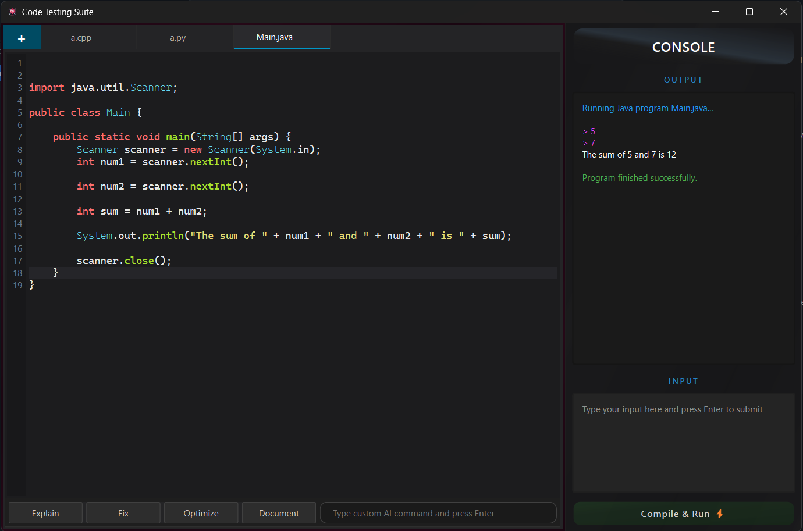
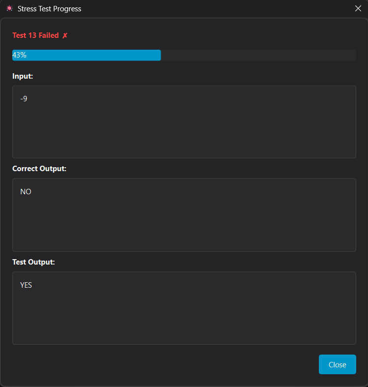
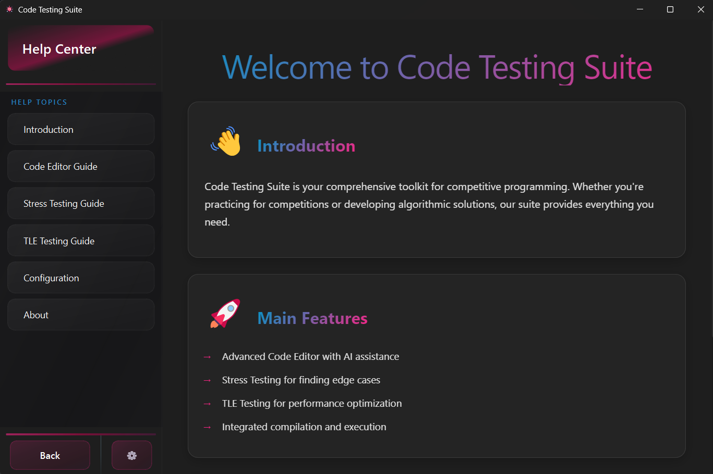

<div align="center">

# 🚀 Code Testing Suite

[](https://opensource.org/licenses/MIT)
[](https://www.python.org)
[](https://www.qt.io)



<p align="center">
A powerful desktop application designed to streamline your coding workflow with advanced testing capabilities and AI assistance. 🎯
</p>

</div>

---

## 📋 Table of Contents

- [✨ Features](#-features)
- [🚀 Installation](#-installation)
- [📖 Usage](#-usage)
- [📸 Screenshots](#-screenshots)
- [⚙️ Configuration](#️-configuration)
- [🤝 Contributing](#-contributing)
- [📄 License](#-license)

## ✨ Features

<div align="center">
<table>
<tr>
<td width="50%" align="center">

### 📝 Code Editor

- Syntax highlighting
- Auto-completion
- Multiple file support
- AI-powered assistance

</td>
<td width="50%" align="center">

### 🔄 Stress Tester

- Custom test cases
- Automated testing
- Performance analysis
- Error detection

</td>
</tr>
<tr>
<td width="50%" align="center">

### ⏱️ TLE Tester

- Time limit testing
- Memory usage tracking
- Performance optimization
- Detailed reports

</td>
<td width="50%" align="center">

### 🤖 AI Assistant

- Code explanations
- Bug detection
- Optimization suggestions
- Smart documentation

</td>
</tr>
</table>
</div>

## 🚀 Installation

<details>
<summary>Click to expand installation steps</summary>

1. **Clone the repository**:
   ```bash
   git clone https://github.com/yourusername/code-testing-suite.git
   cd code-testing-suite
   ```

2. **Install dependencies**:
   ```bash
   pip install -r requirements.txt
   ```

3. **Launch the application**:
   ```bash
   python main.py
   ```
</details>

## 📸 Screenshots

<div align="center">

<details>
<summary>Click to view screenshots</summary>

### 🖥️ Main Interface


### ✏️ Code Editor


### 🔄 Stress Testing


### 📊 Results View


### ❓ Help Center


</details>

</div>

## ⚙️ Configuration

<div align="center">

| Setting | Description |
|---------|-------------|
| 📦 C++ Version | Select your preferred C++ standard |
| 📁 Workspace | Choose your project workspace folder |
| 🤖 API Key | Configure Gemini AI API access |
| ✏️ Editor | Customize editor appearance and behavior |

</div>

## 🤝 Contributing

We welcome contributions! Follow these steps:

1. Fork the repository
2. Create your feature branch: `git checkout -b feature/AmazingFeature`
3. Commit your changes: `git commit -m 'Add AmazingFeature'`
4. Push to the branch: `git push origin feature/AmazingFeature`
5. Open a Pull Request

## 📄 License

This project is licensed under the MIT License - see the [LICENSE](LICENSE) file for details.

---

<div align="center">

### Made with ❤️ for developers who love clean code and efficient testing

[⬆ Back to top](#-code-testing-suite)

</div>
